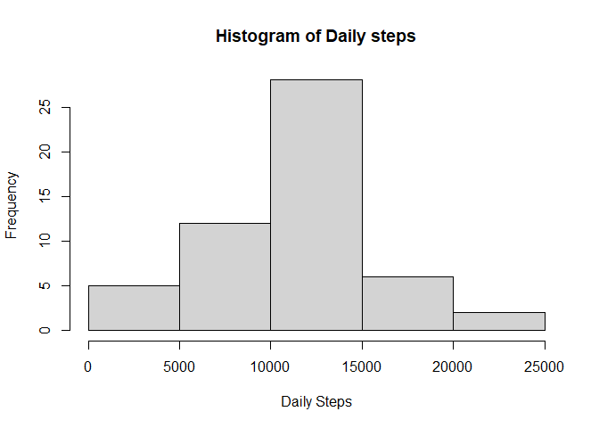
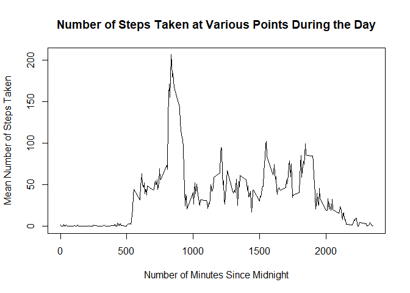
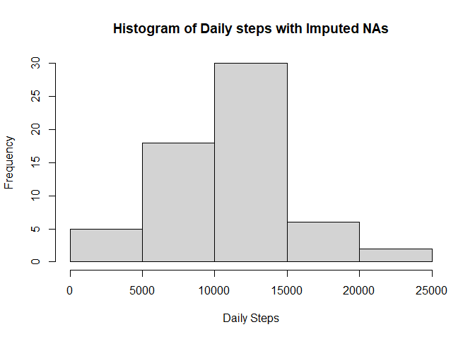
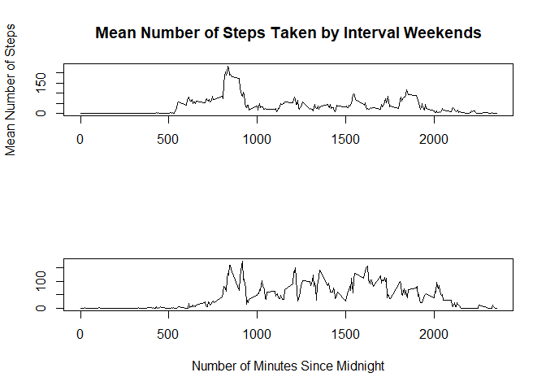

## Loading and preprocessing the data

Loading the data into R

```r
read.csv("./activity/activity.csv") -> activity
```


```r
as.Date(activity$date)->activity$date
```

Splitting it by date

```r
split(activity, as.factor(activity$date)) ->sActivity
```

Splitting it by interval

```r
split(activity, as.factor(activity$interval)) ->iActivity
```

## What is mean total number of steps taken per day?

Create a function to take the sum of all steps on any given day

```r
daysums <- function(frame){
    sum(frame$steps)
}
```

Apply the function over the whole of the list, convert the result to a vector, and take the mean of that vector

```r
unlist(lapply(sActivity, daysums)) -> dailySteps
print("Mean number of steps taken each day")
```

```
## [1] "Mean number of steps taken each day"
```

```r
mean(dailySteps, na.rm= TRUE)
```

```
## [1] 10766.19
```

```r
print("Median number of steps taken each day")
```

```
## [1] "Median number of steps taken each day"
```

```r
median(dailySteps, na.rm= TRUE)
```

```
## [1] 10765
```

```r
hist(dailySteps, main = "Histogram of Daily steps", xlab = "Daily Steps")
```

<!-- -->


## What is the average daily activity pattern?

Create a function to take the mean of all steps across any given interval

```r
iMeans <- function(frame){
    mean(frame$steps, na.rm = TRUE)
}
```

Apply the function over the whole of the list, and convert the result to a vector

```r
unlist(lapply(iActivity, iMeans)) -> intervalMeans
print("Number of steps taken")
```

```
## [1] "Number of steps taken"
```

```r
print(head(intervalMeans))
```

```
##         0         5        10        15        20        25 
## 1.7169811 0.3396226 0.1320755 0.1509434 0.0754717 2.0943396
```
Using this we can get a time plot of the average number of steps taken at any given time during the day

```r
plot(names(intervalMeans),intervalMeans, type = "l", ylab = "Mean Number of Steps Taken", xlab = "Number of Minutes Since Midnight", main = "Number of Steps Taken at Various Points During the Day")
```

<!-- -->

```r
print("the 5 minute interval with the highest number of daily steps is")
```

```
## [1] "the 5 minute interval with the highest number of daily steps is"
```

```r
names(intervalMeans)[which.max(intervalMeans)]
```

```
## [1] "835"
```


## Imputing missing values

Get a named vector which gives na locations

```r
is.na(unlist(lapply(sActivity, daysums))) -> nalist
```


```r
nearbyNonNAs <- function(index, nalocs, range=2){
    #storing an na in indexes so it can be called later
    indexes <- NA
    
    #searches a range of indexes for values
    for(i in (index-range):(index+range)){
        
        #ensures that i is within the bounds where there are values, then
        #determines if the location has non-na values
        if(i>0 && i<=length(nalocs) && nalocs[i] == FALSE){
            if(is.na(indexes)) #replaces indexes if it is empty
                {i -> indexes}
            else #adds to it if it already has a value
                {c(indexes,i)->indexes}
        }
    }
    indexes
}
```


```r
impute <- function(index, nalocs, daydat) {
    nearby <- nearbyNonNAs(index, nalocs)
    daydat[[index]]$steps <- 0
    for(i in nearby)    {
        #add the values of nearby non na locations
        daydat[[index]]$steps + daydat[[i]]$steps -> daydat[[index]]$steps
    }
    #divide it by the number added to get the average (floor makes it whole #)
    daydat[[index]]$steps <- floor(daydat[[index]]$steps/length(nearby))
    daydat
}
```

Bringing it all together, this now takes the average of the nearby values for each non-na interval to fill in the days which have nas. Thus, any long term changes in daily steps will be preserved.

```r
sActivity -> stepdata
for(i in 1:length(nalist)){
    if(nalist[i] == TRUE){
        stepdata <<- impute(i, nalist, stepdata)
    }
}
```

This can now be used to create a plot of the daily step numbers including the nas

```r
unlist(lapply(stepdata, daysums)) -> imputedSteps
hist(imputedSteps, main = "Histogram of Daily steps with Imputed NAs", xlab = "Daily Steps")
```

<!-- -->

```r
print("Mean number of steps taken each day")
```

```
## [1] "Mean number of steps taken each day"
```

```r
mean(imputedSteps, na.rm= TRUE)
```

```
## [1] 10537.21
```

```r
print("Median number of steps taken each day")
```

```
## [1] "Median number of steps taken each day"
```

```r
median(imputedSteps, na.rm= TRUE)
```

```
## [1] 10571
```
These numbers are about 200 lower than the non-imputed values.

## Are there differences in activity patterns between weekdays and weekends?
Extract weekday data

```r
activity -> weekdat
as.Date(weekdat$date)->weekdat$date
weekdays.Date(weekdat$date) -> weekdat$date
```

Remove NAs

```r
weekdat[!is.na(weekdat$steps),1:3]->weekdat
```

Add a function to convert weekday data into a weekend vs weekday indicator

```r
isWkd <- function(weekday){
    ret = TRUE
    if(weekday == "Saturday" || weekday == "Sunday")
        ret <- FALSE
    ret
}
```


```r
unlist(lapply(weekdat$date, isWkd)) -> weekdat$isWeekend
weekdat[weekdat$isWeekend, c(1,3)] -> weekdays
weekdat[!weekdat$isWeekend, c(1,3)] -> weekends
```


```r
library(dplyr)
```

```
## 
## Attaching package: 'dplyr'
```

```
## The following objects are masked from 'package:stats':
## 
##     filter, lag
```

```
## The following objects are masked from 'package:base':
## 
##     intersect, setdiff, setequal, union
```

```r
weekdays %>%
    group_by(interval) %>% #Groups the data so it can be processed by summarise
    summarise(steps=mean(steps))->sumweekdays #finds the sum of emissions by year-type pair
weekends %>%
    group_by(interval) %>% #Groups the data so it can be processed by summarise
    summarise(steps=mean(steps))->sumweekends #finds the sum of emissions by year-type pair
```


```r
par(mfrow=c(2,1))
plot(sumweekends$interval,sumweekdays$steps, type = "l", ylab = "Mean Number of Steps", xlab = "", main = "Mean Number of Steps Taken by Interval Weekends")
plot(sumweekends$interval,sumweekends$steps, type = "l", ylab = "", main="", xlab = "Number of Minutes Since Midnight")
```

<!-- -->
